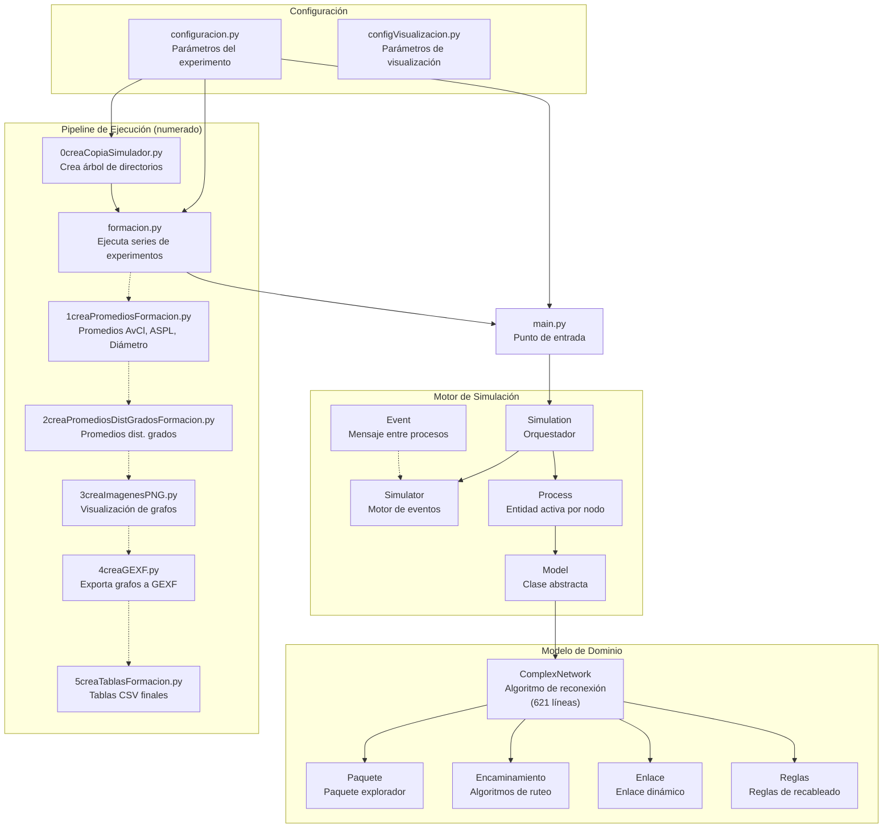
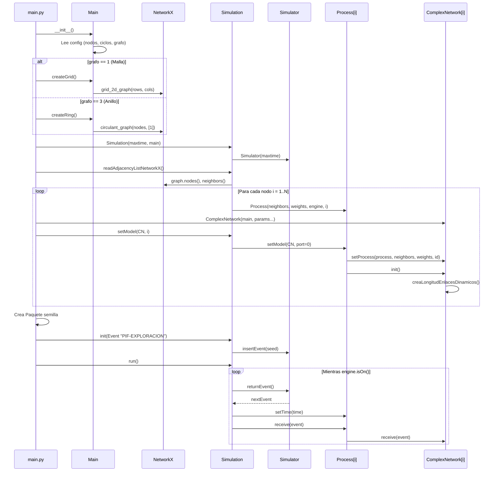
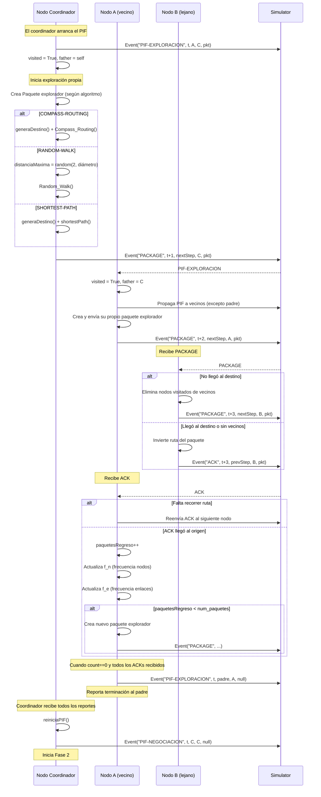
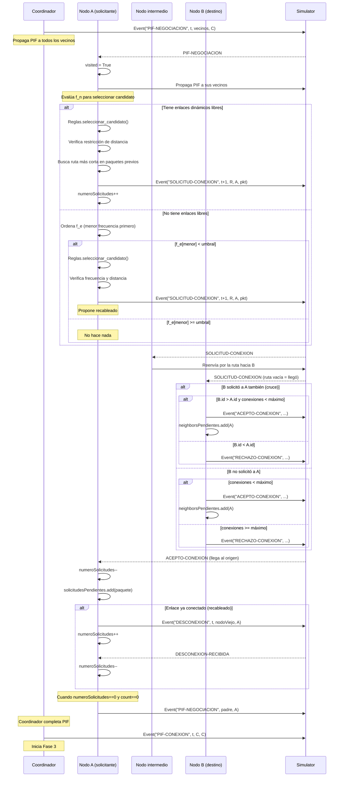
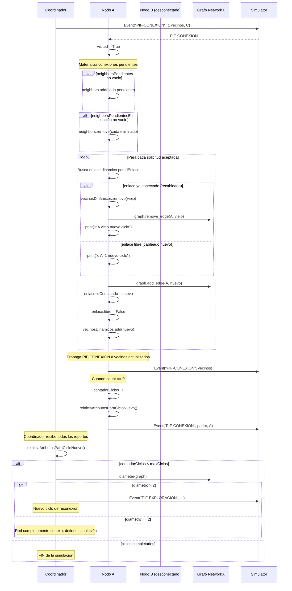
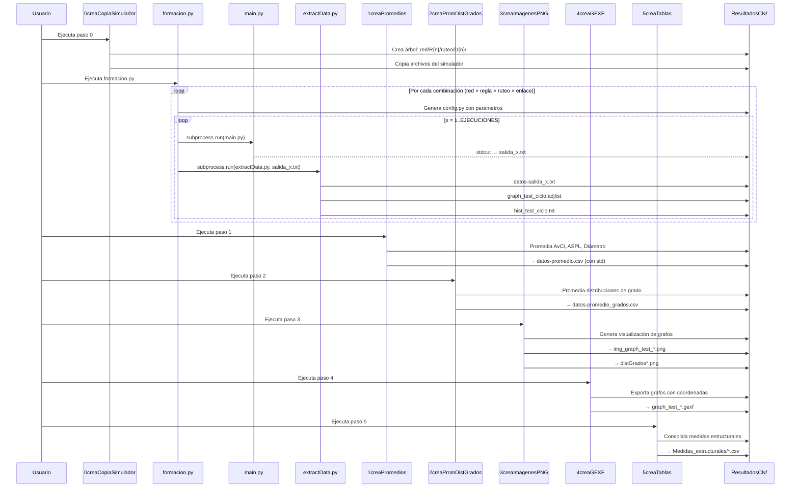

# Rewiring: Simulador de Reconexión en Redes Complejas

## Descripción General

Simulador de eventos discretos para **modelos de reconexión distribuida en redes complejas**, desarrollado en el marco del proyecto de Ciencia de Frontera **CBF-2025-G-1812** (SECIHTI). Se implementa en Python usando NetworkX como base para la creación y análisis de gráficas.

---

## Arquitectura



---

## Componentes Principales

### Motor de Simulación de Eventos Discretos

| Archivo | Líneas | Responsabilidad |
|---------|--------|-----------------|
| [simulator.py](file:///Users/usuario/Repositorios/rewiring/simulator.py) | 47 | Motor con agenda ordenada por tiempo. Inserta/extrae eventos en orden causal |
| [simulation.py](file:///Users/usuario/Repositorios/rewiring/simulation.py) | 79 | Orquesta el experimento: lee el grafo, crea procesos, ejecuta el bucle principal |
| [process.py](file:///Users/usuario/Repositorios/rewiring/process.py) | 80 | Entidad activa en cada nodo. Asocia modelos y reenvía eventos |
| [model.py](file:///Users/usuario/Repositorios/rewiring/model.py) | 83 | Clase abstracta base con métodos [init()](file:///Users/usuario/Repositorios/rewiring/simulation.py#65-68), [receive()](file:///Users/usuario/Repositorios/rewiring/process.py#53-57), [send()](file:///Users/usuario/Repositorios/rewiring/model.py#80-84) |
| [event.py](file:///Users/usuario/Repositorios/rewiring/event.py) | 54 | Encapsula: nombre, tiempo, destino, fuente, paquete, puerto |

### Modelo de Reconexión Distribuida

| Archivo | Líneas | Responsabilidad |
|---------|--------|-----------------|
| [complexNetwork.py](file:///Users/usuario/Repositorios/rewiring/complexNetwork.py) | 621 | **Núcleo del simulador**. Implementa las 3 fases del ciclo de reconexión |
| [paquete.py](file:///Users/usuario/Repositorios/rewiring/paquete.py) | 73 | Paquete explorador: lleva ruta, destino, distancia máxima, ID de enlace |
| [encaminamiento.py](file:///Users/usuario/Repositorios/rewiring/encaminamiento.py) | 119 | 3 algoritmos de ruteo + cálculo de distancias en malla y anillo |
| [enlace.py](file:///Users/usuario/Repositorios/rewiring/enlace.py) | 40 | Enlace dinámico: ID, longitud máxima, estado libre/ocupado, nodo conectado |
| [reglas.py](file:///Users/usuario/Repositorios/rewiring/reglas.py) | 56 | 3 reglas de selección de candidato a reconexión |

---

## Algoritmo de Reconexión (3 Fases por Ciclo)

Cada ciclo de simulación ejecuta 3 fases coordinadas mediante **PIF (Propagation of Information with Feedback)**:

### Fase 1: Exploración (`PIF-EXPLORACION`)
- Cada nodo envía `N` **paquetes exploradores** a la red
- Los paquetes viajan usando uno de los 3 algoritmos de ruteo
- Al regresar (vía `ACK`), se actualizan:
  - `f_n`: frecuencia de visita a nodos no-vecinos
  - `f_e`: frecuencia de uso de enlaces dinámicos

### Fase 2: Negociación (`PIF-NEGOCIACION`)
- Cada nodo selecciona candidatos a conexión usando `f_n` y una regla
- Si tiene enlaces libres → envía `SOLICITUD-CONEXION`
- Si no tiene enlaces libres → evalúa recableado del enlace menos usado (`f_e`)
- Los destinos responden con `ACEPTO-CONEXION` o `RECHAZO-CONEXION`
- Se desempatan solicitudes cruzadas (gana el ID mayor)

### Fase 3: Conexión (`PIF-CONEXION`)
- Se materializan las conexiones/desconexiones aceptadas
- Se actualiza el grafo NetworkX subyacente
- Se imprimen líneas `c` (cableado) o `r` (recableado) a `stdout`
- Se reinician atributos para el nuevo ciclo

---

## Parámetros Configurables

### Topologías iniciales
- **Malla** (`grafo=1`): grid 2D de `ROWS×COLUMNS` (default: 8×8 = 64 nodos)
- **Anillo** (`grafo=3`): grafo circulante de `NODOS_ANILLO` nodos (default: 64)

### Algoritmos de encaminamiento
| Algoritmo | Clave | Descripción |
|-----------|-------|-------------|
| Compass Routing | `CR` | Reenvía al vecino con menor ángulo hacia el destino |
| Shortest Path | `SP` | Calcula ruta más corta vía Dijkstra (usa visión global) |
| Random Walk | `RW` | Camina aleatoriamente hasta [distanciaMaxima](file:///Users/usuario/Repositorios/rewiring/paquete.py#43-46) pasos |

### Reglas de recableado
| Regla | Selección de candidato |
|-------|----------------------|
| R1 | Nodo más visitado en `f_n` (mayor frecuencia) |
| R2 | Primer nodo en `f_n` (orden de descubrimiento) |
| R3 | Selección probabilística proporcional a la frecuencia en `f_n` |

### Otros parámetros
- `ENLACES_DINAMICOS = 2` — enlaces dinámicos por nodo
- `EXPLORADORES = 6` — paquetes exploradores por ciclo
- `CICLOS = 5` — ciclos de reconexión
- `EJECUCIONES = 4` — repeticiones por experimento
- `LONG_ENLACES = [1, 2, 4]` — divisores de longitud máxima de enlace
- `DIV_CONEXIONES = 1` — divisor del máximo de conexiones permitidas

---

## Pipeline de Experimentos

El flujo de trabajo para ejecutar y analizar experimentos se realiza en orden secuencial:

| Paso | Script | Descripción |
|------|--------|-------------|
| 0 | [0creaCopiaSimulador.py](file:///Users/usuario/Repositorios/rewiring/0creaCopiaSimulador.py) | Crea árbol de directorios y copia archivos del simulador a cada carpeta de experimento |
| — | [formacion.py](file:///Users/usuario/Repositorios/rewiring/formacion.py) | Ejecuta [main.py](file:///Users/usuario/Repositorios/rewiring/main.py) + [extractData.py](file:///Users/usuario/Repositorios/rewiring/extractData.py) para cada combinación de parámetros × ejecuciones |
| 1 | [1creaPromediosFormacion.py](file:///Users/usuario/Repositorios/rewiring/1creaPromediosFormacion.py) | Calcula promedios y desviación estándar de AvCl, ASPL y Diámetro → `datos-promedio.csv` |
| 2 | [2creaPromediosDistGradosFormacion.py](file:///Users/usuario/Repositorios/rewiring/2creaPromediosDistGradosFormacion.py) | Promedia distribuciones de grado → `datos-promedio_grados.csv` |
| 3 | [3creaImagenesPNG.py](file:///Users/usuario/Repositorios/rewiring/3creaImagenesPNG.py) | Genera imágenes de grafos (coloreados por grado) e histogramas de distribución de grados |
| 4 | [4creaGEXF.py](file:///Users/usuario/Repositorios/rewiring/4creaGEXF.py) | Exporta grafos finales a formato GEXF (para Gephi) con coordenadas espaciales |
| 5 | [5creaTablasFormacion.py](file:///Users/usuario/Repositorios/rewiring/5creaTablasFormacion.py) | Genera tablas CSV con medidas estructurales consolidadas por combinación de parámetros |

### Estructura de resultados (`ResultadosCN/Formacion/`)
```
Formacion/
├── malla8x8/
│   ├── R1/
│   │   ├── CR/
│   │   │   ├── D1/
│   │   │   │   ├── 1/ ... 4/   (ejecuciones)
│   │   │   │   └── datos-promedio.csv
│   │   │   ├── D2/ ...
│   │   │   └── D4/ ...
│   │   ├── RW/ ...
│   │   └── SP/ ...
│   ├── R2/ ...
│   └── R3/ ...
├── anillo64/ ...
└── Medidas_estructurales/
    └── Medidas_estructurales_*.csv
```

---

## Métricas Extraídas por Experimento

La salida de [extractData.py](file:///Users/usuario/Repositorios/rewiring/extractData.py) registra por cada ciclo:
- **Average Clustering (AvCl)** — coeficiente de agrupamiento promedio
- **Nº Connected Components** — componentes conexas
- **Diameter** — diámetro del grafo
- **Average Shortest Path Length (ASPL)** — longitud de trayectoria promedio
- **Order** — número de nodos

---

## Espacio de Experimentos Actual

Con la configuración en [configuracion.py](file:///Users/usuario/Repositorios/rewiring/configuracion.py), se generan:

| Dimensión | Valores | Total |
|-----------|---------|-------|
| Topologías | malla8x8, anillo64 | 2 |
| Reglas | R1, R2, R3 | 3 |
| Ruteo | SP, CR, RW | 3 |
| Long. enlace | D1, D2, D4 | 3 |
| Ejecuciones | 1–4 | 4 |
| **Total de simulaciones** | | **216** |

---

## Dependencias

- `networkx` — manipulación y análisis de grafos
- `numpy` — cálculos estadísticos (promedios, std, selección probabilística)
- `matplotlib` — generación de imágenes PNG
- Librería estándar: `math`, `random`, `sys`, [os](file:///Users/usuario/Repositorios/rewiring/main.py#65-68), `shutil`, `subprocess`, [re](file:///Users/usuario/Repositorios/rewiring/.DS_Store), `operator`, `pathlib`

### Instalación

```bash
pip install -r requirements.txt
```

---

## Diagramas de Secuencia

### 1. Inicialización del Simulador



### 2. Fase de Exploración (PIF-EXPLORACION)



### 3. Fase de Negociación (PIF-NEGOCIACION)



### 4. Fase de Conexión (PIF-CONEXION)



### 5. Pipeline de Experimentos


