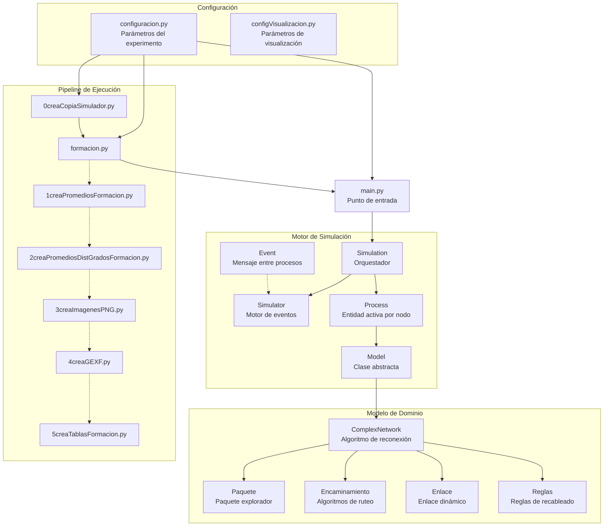
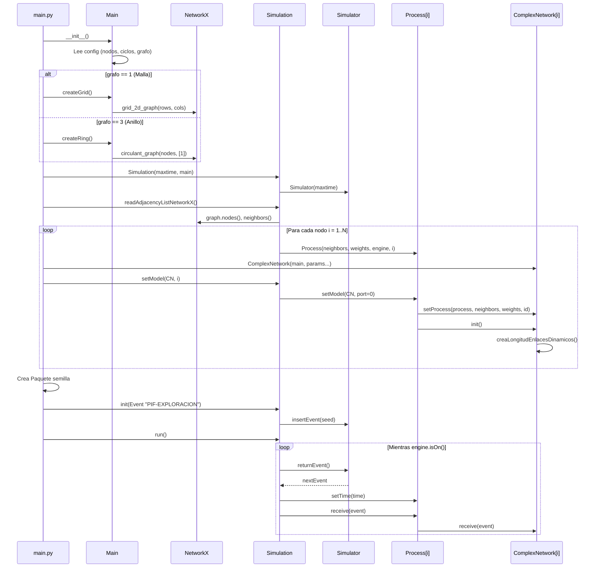
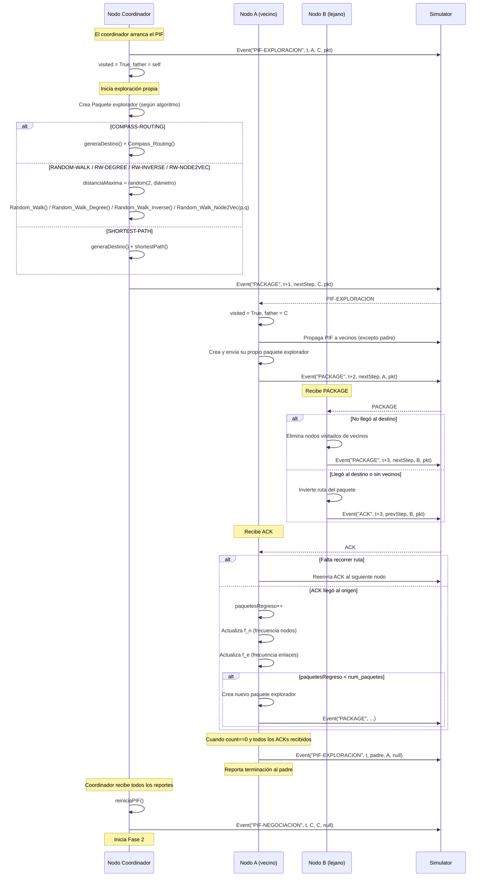
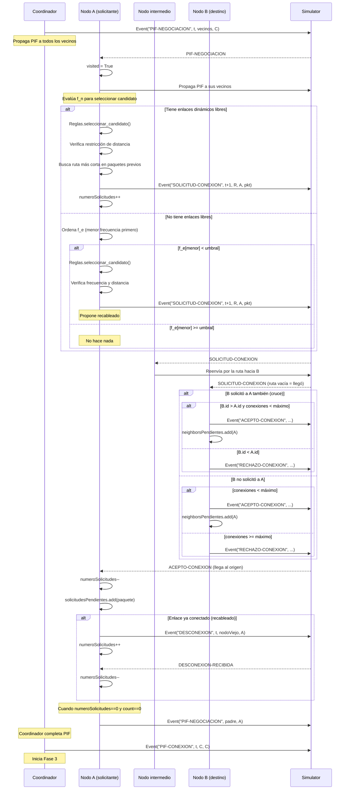
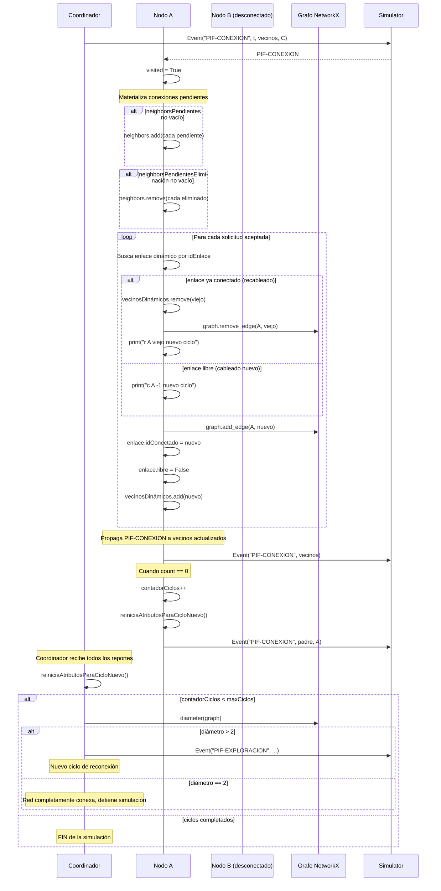
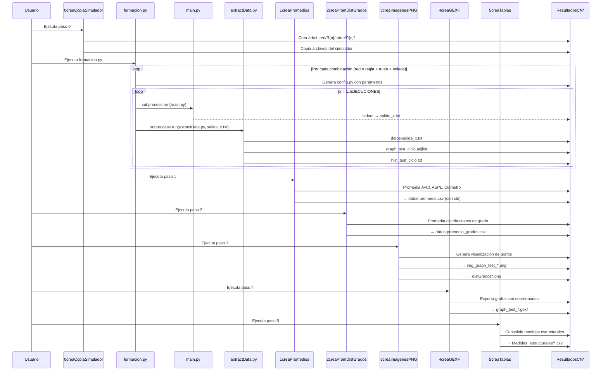

# Rewiring: Simulador de Reconexión Distribuida en Redes Complejas

Simulador de eventos discretos para **modelos de reconexión distribuida en redes complejas**, desarrollado en el marco del proyecto de Ciencia de Frontera **"Modelos de reconexión para la autoorganización de redes complejas de gran escala" (CBF-2025-G-1812)**, apoyado por la Secretaría de Ciencia, Humanidades, Tecnología e Innovación (SECIHTI).

---

## I. Instalación

1. Crear un ambiente de Python (se recomienda Anaconda).
2. Clonar el repositorio:
   ```bash
   git clone https://github.com/netscience/rewiring.git
   cd rewiring
   ```
3. Instalar dependencias:
   ```bash
   pip install -r requirements.txt
   ```

### Dependencias
- `networkx` — creación y análisis de grafos
- `numpy` — cálculos estadísticos (promedios, desviación estándar, selección probabilística)
- `matplotlib` — generación de imágenes PNG

### Configuración de rutas

Modificar `configuracion.py` para indicar la ruta de la carpeta de resultados:

```python
BASE_DIR = str(home_path) + "/Documents/Repositorios/ResultadosCN/"
RESULTADOS_DIR = BASE_DIR + "Formacion"
```

Se recomienda crear un directorio exclusivo para los resultados considerando la ruta relativa al home del usuario.

---

## II. Experimentos de formación de redes

### Configuración de parámetros

Todos los parámetros se definen en `configuracion.py`:

| Parámetro | Variable | Valores por defecto | Descripción |
|-----------|----------|-------------------|-------------|
| Topología inicial | `RED` | `["malla", "anillo"]` | Malla 2D o anillo circulante |
| Orden de la topología | `ROWS`, `COLUMNS`, `NODOS_ANILLO` | 8×8, 64 | Número de nodos |
| Regla de reconexión | `REGLAS` | `[1, 2, 3]` | R1, R2 o R3 |
| Algoritmo de ruteo | `ROUTING` | `["SHORTEST-PATH", "COMPASS-ROUTING", "RANDOM-WALK", "RW-DEGREE", "RW-INVERSE", "RW-NODE2VEC"]` | SP, CR, RW, RWD, RWI o N2V |
| Parámetros node2vec | `PQ_NODE2VEC` | lista de tuplas `(p, q)` | Pares de parámetros de retorno (`p`) y exploración (`q`) para `RW-NODE2VEC` |
| Longitud de enlace | `LONG_ENLACES` | `[1, 2, 4]` | Divisores de la longitud máxima (D, D/2, D/4) |
| Ciclos de reconexión | `CICLOS` | `5` | Número de ciclos por simulación |
| Ejecuciones | `EJECUCIONES` | `4` | Repeticiones por configuración |
| Enlaces dinámicos | `ENLACES_DINAMICOS` | `2` | Enlaces dinámicos por nodo |
| Exploradores | `EXPLORADORES` | `6` | Paquetes exploradores por nodo y ciclo |
| Máx. conexiones | `DIV_CONEXIONES` | `1` | Divisor del máximo de conexiones (nodos/DIV) |
| Workers en paralelo | `NUM_WORKERS` | `4` | Número de procesos paralelos para ejecutar simulaciones |

### Paralelismo y Selección de Workers

El simulador ejecuta las configuraciones independientes de forma paralela para acelerar sustancialmente el tiempo total de procesamiento. El grado de paralelismo se controla con el parámetro `NUM_WORKERS` en `configuracion.py`.

#### 1. Cómo identificar el número de núcleos (cores) en tu equipo

Para saber cuántos núcleos lógicos tiene tu procesador, puedes ejecutar el siguiente comando según tu sistema operativo:

* **macOS**:
  Abre la Terminal y ejecuta:
  ```bash
  sysctl -n hw.ncpu
  ```
* **Linux**:
  Abre la Terminal y ejecuta:
  ```bash
  nproc
  # o alternativamente:
  lscpu | grep "^CPU(s):"
  ```
* **Windows**:
  Abre PowerShell y ejecuta:
  ```powershell
  (Get-WmiObject Win32_ComputerSystem).NumberOfLogicalProcessors
  ```
  *(También se puede ver abriendo el **Administrador de Tareas** -> pestaña **Rendimiento** -> sección **CPU** -> **Procesadores lógicos**).*

#### 2. Criterios para configurar `NUM_WORKERS`

* **Rendimiento Máximo:** Configura `NUM_WORKERS` como `N - 1` o `N - 2` (donde `N` es la cantidad de procesadores lógicos). Por ejemplo, si tienes 10 núcleos, selecciona `8` o `9` workers. Esto evitará que la computadora se congele y te permitirá seguir usándola con fluidez para navegar o editar código.
* **Trabajo de Fondo:** Si requieres usar otros programas pesados en paralelo, utiliza `N / 2` o `2 * N / 3` (ej. 6 workers en un procesador de 10 núcleos).
* **RAM y Escala de Red:** Cada worker mantiene en memoria las estructuras y caminos mínimos de NetworkX. Si trabajas con redes grandes (ej. 2500 nodos o más), supervisa el Monitor de Actividad o el Administrador de Tareas para verificar que el uso acumulado de memoria RAM no supere el límite físico de tu equipo.

### Ejecución del pipeline

El flujo de trabajo se ejecuta en orden secuencial:

| Paso | Script | Descripción |
|------|--------|-------------|
| 1 | `0creaCopiaSimulador.py` | Crea el árbol de directorios y copia los scripts del simulador |
| 2 | `formacion.py` | Ejecuta `main.py` + `extractData.py` para cada combinación de parámetros |
| 3 | `1creaPromediosFormacion.py` | Calcula promedios y desviación estándar → `datos-promedio.csv` |
| 4 | `2creaPromediosDistGradosFormacion.py` | Promedia distribuciones de grado → `datos-promedio_grados.csv` |
| 5 | `3creaImagenesPNG.py` | Genera imágenes de grafos e histogramas de distribución de grados |
| 6 | `4creaGEXF.py` | Exporta grafos a formato GEXF (para Gephi con geoLayout) |
| 7 | `5creaTablasFormacion.py` | Genera tablas CSV consolidadas en `Formacion/Medidas_estructurales/` |

> **Nota:** Antes de ejecutar los pasos 5–7, configurar `NODE_SCALE` en `configVisualizacion.py`:
> - `NODE_SCALE = 1` para anillo ≈ 1500 nodos y malla ≈ 2500 nodos
> - `NODE_SCALE = 20` para anillo ≈ 50 nodos y malla ≈ 64 nodos

### Estructura de resultados

```
ResultadosCN/Formacion/
├── malla50x50/
│   ├── R1/
│   │   ├── CR/
│   │   │   ├── D2/
│   │   │   │   ├── config.py
│   │   │   │   ├── 1/ ... 10/         ← ejecuciones
│   │   │   │   │   ├── salida_x.txt
│   │   │   │   │   ├── metricas_rendimiento.csv
│   │   │   │   │   ├── datos-salida_x.txt
│   │   │   │   │   ├── graph_test_*.adjlist
│   │   │   │   │   └── hist_test_*.txt
│   │   │   │   ├── datos-promedio.csv
│   │   │   │   └── datos-promedio_grados.csv
│   │   │   ├── D4/ ...
│   │   │   └── D8/ ...
│   │   ├── RW/  ...                   ← Random Walk clásico
│   │   ├── RWD/ ...                   ← Random Walk — Degree
│   │   ├── RWI/ ...                   ← Random Walk — Inverse Degree
│   │   ├── N2Vp0_25q0_25/            ← Node2Vec (p=0.25, q=0.25)
│   │   │   ├── D2/ ...
│   │   │   └── D4/ ...
│   │   ├── N2Vp0_25q0_5/ ...
│   │   ├── ...                        ← una carpeta por cada par (p,q)
│   │   ├── N2Vp2q2/ ...
│   │   └── SP/ ...
│   ├── R2/ ...
│   └── R3/ ...
├── anillo64/ ...
└── Medidas_estructurales/
    └── Medidas_estructurales_*.csv
```

### Métricas estructurales extraídas

Para cada ciclo de reconexión, `extractData.py` genera:

| Métrica | Descripción |
|---------|-------------|
| **AvCl** | Coeficiente de agrupamiento promedio |
| **ASPL** | Longitud de trayectoria promedio (Average Shortest Path Length) |
| **Diámetro** | Diámetro del grafo |
| **Componentes** | Número de componentes conexas |
| **Orden** | Número de nodos |

### Métricas de rendimiento (mensajes intercambiados)

| Métrica | Descripción | Unidad |
|---------|-------------|--------|
| `Tiempo_Ejecucion_Segundos` | Tiempo total de ejecución de la simulación | segundos |
| `Mensajes_Intercambiados` | Número total de mensajes intercambiados | entero |
| `PIF-EXPLORACION` | Mensajes PIF enviados en fase de exploración | entero |
| `PACKAGE` | Paquetes de datos enviados | entero |
| `ACK` | Mensajes de reconocimiento enviados | entero |
| `PIF-NEGOCIACION` | Mensajes PIF enviados en fase de negociación | entero |
| `SOLICITUD-CONEXION` | Solicitudes de conexión enviadas | entero |
| `ACEPTO-CONEXION` | Confirmaciones de conexión aceptadas | entero |
| `DESCONEXION` | Solicitudes de desconexión iniciadas | entero |
| `DESCONEXION-RECIBIDA` | Confirmaciones de desconexión recibidas | entero |
| `RECHAZO-CONEXION` | Rechazos de conexión recibidos | entero |
| `PIF-CONEXION` | Mensajes PIF enviados en fase de conexión | entero |

### Espacio de experimentos

Con la configuración por defecto se generan:

| Dimensión | Valores | Cantidad |
|-----------|---------|----------|
| Topologías | malla50x50 | 1 |
| Reglas | R1, R2, R3 | 3 |
| Ruteo base | RWD, RWI | 2 |
| Ruteo node2vec | N2V × 16 combinaciones (p,q) | 16 |
| Long. enlace | D2, D4, D8, D16, D32 | 5 |
| Ejecuciones | 1–10 | 10 |
| **Total** | **(2 + 16) × 3 × 5 × 10** | **2 700 simulaciones** |

> **Nota:** Para agregar los algoritmos clásicos (`SP`, `CR`, `RW`) simplemente inclúyelos en la lista `ROUTING` de `configuracion.py`.

---

## III. Arquitectura del simulador



### Componentes del simulador

#### Motor de simulación de eventos discretos

| Archivo | Responsabilidad |
|---------|-----------------|
| `simulator.py` | Motor con agenda ordenada por tiempo. Inserta/extrae eventos en orden causal |
| `simulation.py` | Orquesta el experimento: lee el grafo, crea procesos, ejecuta el bucle principal |
| `process.py` | Entidad activa en cada nodo. Asocia modelos y reenvía eventos |
| `model.py` | Clase abstracta base con métodos `init()`, `receive()`, `send()` |
| `event.py` | Encapsula: nombre, tiempo, destino, fuente, paquete, puerto |

#### Modelo de reconexión distribuida

| Archivo | Responsabilidad |
|---------|-----------------|
| `complexNetwork.py` | **Núcleo del simulador**. Implementa las 3 fases del ciclo de reconexión |
| `paquete.py` | Paquete explorador: lleva ruta, destino, distancia máxima, ID de enlace |
| `encaminamiento.py` | 3 algoritmos de ruteo + cálculo de distancias en malla y anillo |
| `enlace.py` | Enlace dinámico: ID, longitud máxima, estado libre/ocupado, nodo conectado |
| `reglas.py` | 3 reglas de selección de candidato a reconexión |

---

## IV. Algoritmo de reconexión

Cada ciclo de simulación ejecuta 3 fases coordinadas mediante **PIF (Propagation of Information with Feedback)**:

### Fase 1: Exploración (`PIF-EXPLORACION`)
- Cada nodo envía `N` **paquetes exploradores** a la red
- Los paquetes viajan usando uno de los **6 algoritmos de ruteo** disponibles
- Al regresar (vía `ACK`), se actualizan:
  - `f_n`: frecuencia de visita a nodos no-vecinos
  - `f_e`: frecuencia de uso de enlaces dinámicos

### Fase 2: Negociación (`PIF-NEGOCIACION`)
- Cada nodo selecciona candidatos a conexión usando `f_n` y una regla
- Si tiene enlaces libres → envía `SOLICITUD-CONEXION`
- Si no tiene enlaces libres → evalúa recableado del enlace menos usado (`f_e`)
- Los destinos responden con `ACEPTO-CONEXION` o `RECHAZO-CONEXION`
- Se desempatan solicitudes cruzadas (gana el ID mayor)

### Fase 3: Conexión (`PIF-CONEXION`)
- Se materializan las conexiones/desconexiones aceptadas
- Se actualiza el grafo NetworkX subyacente
- Se imprimen líneas `c` (cableado) o `r` (recableado) a `stdout`
- Se reinician atributos para el nuevo ciclo

### Algoritmos de encaminamiento

| Algoritmo | Clave | Descripción |
|-----------|-------|-------------|
| Compass Routing | `CR` | Reenvía al vecino con menor ángulo hacia el destino |
| Shortest Path | `SP` | Calcula ruta más corta vía Dijkstra (usa visión global) |
| Random Walk | `RW` | Camina aleatoriamente hasta `distanciaMaxima` pasos |
| Random Walk — Degree | `RWD` | Caminata sesgada por grado: P(u) ∝ deg(u). Favorece saltar hacia nodos de alta conectividad (hubs) |
| Random Walk — Inverse Degree | `RWI` | Caminata sesgada por grado inverso: P(u) ∝ 1/deg(u). Favorece nodos periféricos de baja conectividad |
| Random Walk — Node2Vec | `N2V` | Caminata con sesgo de retorno (`p`) y exploración (`q`). `q < 1` favorece DFS (exploración lejana); `q > 1` favorece BFS (exploración local). Configurado mediante `PQ_NODE2VEC` |

> Los algoritmos **RWD**, **RWI** y **N2V** se basan en el análisis comparativo de estrategias de caminata aleatoria presentado en:
>
> Vital Jr., A., Silva, F. N., & Amancio, D. R. (2024). **Comparing random walks in graph embedding and link prediction**. *PLOS ONE*, 19(11), e0312863. https://doi.org/10.1371/journal.pone.0312863

#### Configuración de parámetros node2vec

Cuando `ROUTING` incluye `"RW-NODE2VEC"`, se deben definir las combinaciones de parámetros en `PQ_NODE2VEC`:

```python
# configuracion.py
PQ_NODE2VEC = [
    (0.25, 0.25), (0.25, 0.5), (0.25, 1), (0.25, 2),
    (0.5,  0.25), (0.5,  0.5), (0.5,  1), (0.5,  2),
    (1,    0.25), (1,    0.5), (1,    1), (1,    2),
    (2,    0.25), (2,    0.5), (2,    1), (2,    2),
]
```

| Parámetro | Efecto |
|-----------|--------|
| `p < 1` | Incentiva el retorno al nodo anterior (exploración local) |
| `p > 1` | Desincentiva el retorno (evita dar la vuelta) |
| `q < 1` | Favorece exploración hacia nodos lejanos (DFS) |
| `q > 1` | Favorece exploración de la vecindad inmediata (BFS) |

Cada combinación `(p, q)` genera una subdirectorio independiente con la nomenclatura `N2Vp{p}q{q}/D{long}/`.

### Reglas de recableado

| Regla | Selección de candidato |
|-------|----------------------|
| R1 | Nodo más visitado en `f_n` (mayor frecuencia) |
| R2 | Primer nodo en `f_n` (orden de descubrimiento) |
| R3 | Selección probabilística proporcional a la frecuencia en `f_n` |

---

## V. Diagramas de secuencia

### 1. Inicialización del simulador



### 2. Fase de exploración (PIF-EXPLORACION)



### 3. Fase de negociación (PIF-NEGOCIACION)



### 4. Fase de conexión (PIF-CONEXION)



### 5. Pipeline de experimentos



---

## VI. Referencias

### Algoritmos de encaminamiento

- Kranakis, E., Singh, H., & Urrutia, J. (1999). **Compass routing on geometric networks**. In *Proceedings of the 11th Canadian Conference on Computational Geometry (CCCG '99)*, pp. 51–54. Vancouver, BC, Canada. http://www.cccg.ca/proceedings/1999/c46.pdf

  > Artículo original que define el algoritmo **Compass Routing** implementado en la fase de exploración: el paquete siempre avanza hacia el vecino cuya dirección minimiza el ángulo respecto al destino.

- Grover, A., & Leskovec, J. (2016). **node2vec: Scalable feature learning for networks**. In *Proceedings of the 22nd ACM SIGKDD International Conference on Knowledge Discovery and Data Mining (KDD '16)*, pp. 855–864. https://doi.org/10.1145/2939672.2939754 · Preprint: https://arxiv.org/abs/1607.00653

  > Artículo original que define el algoritmo **node2vec**: una caminata aleatoria sesgada por dos parámetros `p` (retorno) y `q` (exploración) que interpola entre búsqueda en anchura (BFS) y en profundidad (DFS). Es la base del algoritmo `RW-NODE2VEC` implementado en la fase de exploración.

- Vital Jr., A., Silva, F. N., & Amancio, D. R. (2024). **Comparing random walks in graph embedding and link prediction**. *PLOS ONE*, 19(11), e0312863. https://doi.org/10.1371/journal.pone.0312863

  > Análisis comparativo de estrategias de caminata aleatoria —incluyendo node2vec, degree-biased e inverse degree-biased— que fundamenta la selección de los algoritmos **RW-DEGREE**, **RW-INVERSE** y **RW-NODE2VEC** implementados en la fase de exploración.

### Publicaciones que utilizan este simulador

- López Chavira, M. A., & Marcelín-Jiménez, R. (2017). **Distributed rewiring model for complex networking: The effect of local rewiring rules on final structural properties**. *PLOS ONE*, 12(11), e0187538. https://doi.org/10.1371/journal.pone.0187538

  > Primera publicación que introduce el modelo distribuido de reconexión implementado en este simulador. Se analizan las reglas de reconexión local (R1, R2, R3) y su efecto en propiedades estructurales globales como el coeficiente de agrupamiento y el diámetro.

- López-Chavira, M. A., Aguirre-Guerrero, D., Marcelín-Jiménez, R., Vásquez-Toledo, L. A., & Bernal-Jaquez, R. (2024). **A distributed geometric rewiring model**. *Scientific Reports*, 14, 11152. https://doi.org/10.1038/s41598-024-61695-y

  > Extensión del modelo que incorpora restricciones geométricas a la reconexión mediante el parámetro de longitud de enlace (`LONG_ENLACE`). Se demuestra que limitar la distancia máxima del enlace dinámico permite obtener topologías con propiedades de mundo pequeño preservando la localidad geográfica.
